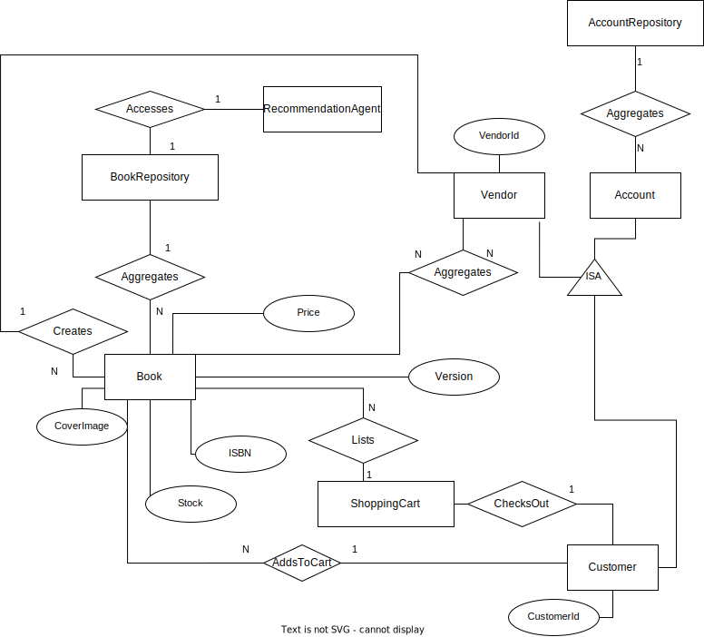
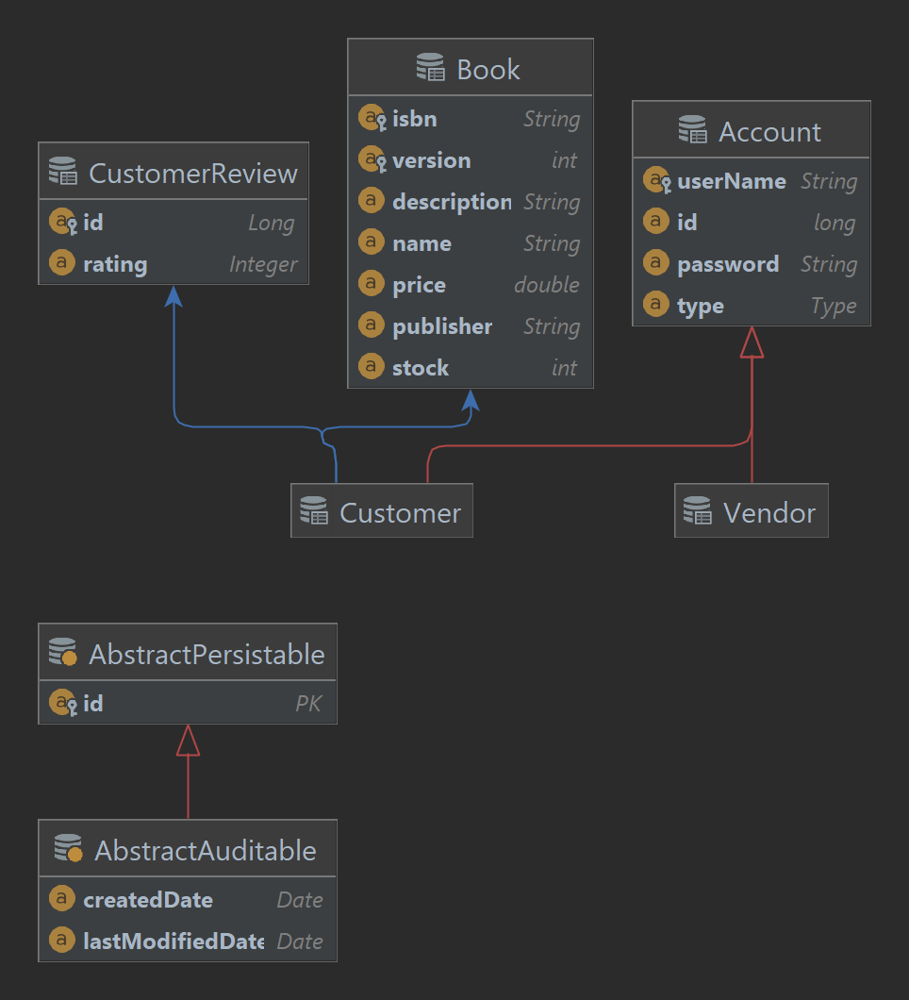

# SYSC4806_Project
Amazin online bookstore

# Project Requirement

Bookstore Owner can upload and edit amazin.model.Book information (ISBN, picture, description, author, publisher,...) and inventory. 
User can search for, and browse through, the books in the bookstore, sort/filter them based on the above information. 
User can then decide to purchase one or many books by putting them in the Shopping Cart and proceeding to Checkout. 
The purchase itself will obviously be simulated, but purchases cannot exceed the inventory. 
User can also view amazin.model.Book Recommendations based on past purchases. 
This is done by looking for users whose purchases are most similar (using Jaccard distance: Google it!), and then recommending books purchased by those similar users but that the current User hasn't yet purchased.

# How To Run

Run the main method in BookStore.java or

Run maven life cycle package in IntelliJ and then

Run `proj2-1.0-SNAPSHOT.jar` in the /target output folder to run the program using the generated jar file

And visit:

http://localhost:8080

To see the website from the home page, which is our sign up/prompt for login page

# Entity Relation Diagram

# Entity Relation Diagram (Persistent Entities)

# UML Diagram

# Milestone 2 use case flow

The Vendor use case we have completed is create a Vendor account, Login, View all Book, Create New Book and Edit Book for books in the database.

On the home page on `localhost:8080`, which double as the sign up page we can create a Vendor Account by entering a username, password and selecting the checkbox that this is a Vendor Account.

If the Sign Up is succesfully (Non empty username + password And Unique username), then we will redirected to the VendorLogin page.
On the Vendor Login Page we can log in with our newly created Vendor Account.

If our login is succeful, we will be redirected to the Vendor main page which will display all the books currently in inventory.

We Can Use the "Create Books" link above to go to the Create Books page where we can create a new Book to add in our inventory.

If succesful, we will be redirected to Vendor Home page and see our newly added book Displayed.

We Can Use the "Edit Books: link above to go to the Edit Books page where we can edit a currently existing Book in our Inventory based on isbn and version.

If succesful, the Book will be edited in our inventory

# Milestone 3 Plan

For milestone 3, we want to flesh out the shopper and shopping cart features of the project, as well as have better CSS for all of the webpages.

Also the jaccard distance should be finished.

## phase 1 (sprint 1)

complete shopper view, the customer view which will list all the books

the shopper should have two buttons to increment and decreement the books from the inventory and add it/remove it from the shopping cart

## phase 2 (sprint 1)

complete the shopping cart feature which will display all the books in the shopping cart

the shopping cart should checkout and display the total price

## phase 3 (sprint 2)

complete the jaccard distance feature for our customer and other users to see how similar everyone's code are.

# Group Members

- Sabin Plaiasu

- YouHeng Zhou

- Sahil Agrawal

- Muhammad Furqan

- Nikolas Paterson
