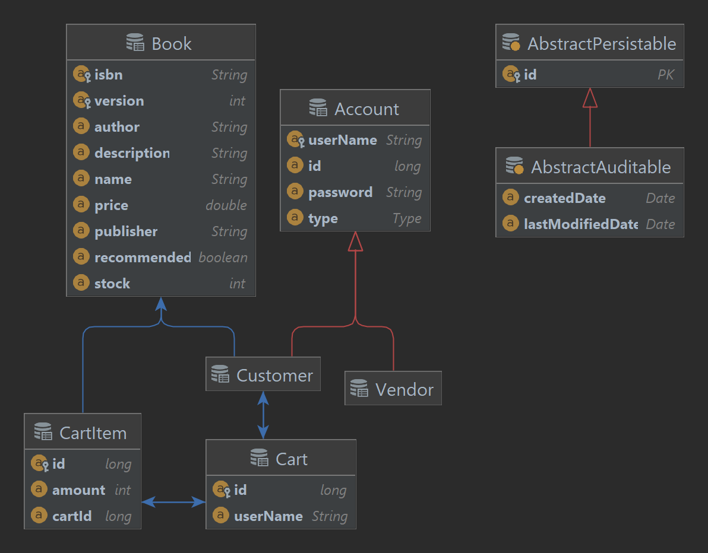

# SYSC4806_Project
Amazin online bookstore

# Project Requirement

Bookstore Owner can upload and edit amazin.model.Book information (ISBN, picture, description, author, publisher,...) and inventory. 
User can search for, and browse through, the books in the bookstore, sort/filter them based on the above information. 
User can then decide to purchase one or many books by putting them in the Shopping Cart and proceeding to Checkout. 
The purchase itself will obviously be simulated, but purchases cannot exceed the inventory. 
User can also view amazin.model.Book Recommendations based on past purchases. 
This is done by looking for users whose purchases are most similar (using Jaccard distance: Google it!), and then recommending books purchased by those similar users but that the current User hasn't yet purchased.

# How To Run

Run the main method in BookStore.java or

Run maven life cycle package in IntelliJ and then

Run `proj2-1.0-SNAPSHOT.jar` in the /target output folder to run the program using the generated jar file

And visit:

http://localhost:8080

To see the website from the home page, which is has our login/sign up prompts for vendor and customer workflows

# Entity Relation Diagram (Persistent Entities)

# UML Diagram

# Milestone 3, Final Milestone Feature Set

For milestone 3, the final milestone, we have finished the milestone goals we layed out in milestone 2, which is to finish the customer shopping cart, buy books, checkout, and jaccard distance recommendation system workflows.

We have successfully implemented all of the features along with tests for all the pages and backend repository calls along with CSS styling rework for all of our webpages 

Above is our main page for the bookstore, which has a nav bar with three buttons, Customer Login, Vendor Login, and Sign Up that leads to each of our user's usecase workflows.

## Login/Create Account Features

Next, we have kept the Sign Up page features the same from previous milestones, except for the CSS styling changes here, which are overhauled to be consistent throughout our entire website.

Below, we can still create a new account, and since we did vendor's workflow for milestone 2, and this time for our milestone 3's workflow we are creating customers' workflow, we will create a new customer here, Gary.

And we will sign in as Gary below:

## Customer User Features

Next, once we logged in as Gary, we get to see all the books that are in the bookstore below.

Here, we have filter features

We can filter by publisher, such as O'Reilly

And here are the books published by O'Reilly

And we can filter by author, such as Tora Kaze

And we have all the books wrote by Tora Kaze below

And let's say Gary is a big fan of Tora Kaze, so he buys both of his books here, Golden Days and The Light of Carleton

You can even buy more than one books by clicking the increment icon here, say if you want to buy The Light of Carleton for a friend.

Next, once we put both books into the shopping cart, we can view our shopping cart by clicking the shopping cart icon on the nav bar here.

And next we can click Proceed to Checkout

And we can see the total cost of our inventory is about 50 dollars. And next, we click on Confirm Checkout, we are taken to the Purchased Books page where we can see a page of confirmation.

## Jaccard Distance Feature

Next, we will log out, and log back in with a sample account, customer1, where we will buy one of the books by the famous author Tora Kaze, and check out if Jaccard Distance will recommend us the other book also buy Tora Kaze, since customer1's taste will be similar to Gary's taste in books.

Now, we will buy 1 of Golden Days, to see if The Light of Carleton will get recommended.

Next we proceed to checkout and buy the book in our My Cart shopping cart.

And volia! The Light of Carleton, a book which customer1 has not bought before, is recommended, since customer1 bought Golden Days, and our other customer, Gary, has also bought Golden Days, and also bought The Light of Carleton, therefore, our system intelligently uses Jaccard Distance to determine our two user's tastes are similar, and recommended The Light of Carleton to this user.

# Group Members

- Sabin Plaiasu

- YouHeng Zhou

- Sahil Agrawal

- Muhammad Furqan

- Nikolas Paterson
